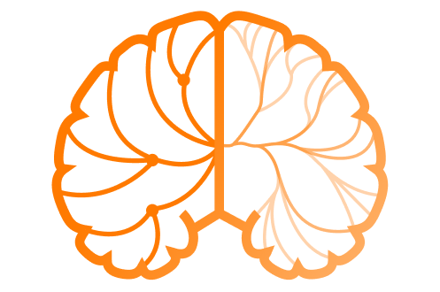

<!-- README.md is generated from README.Rmd. Please edit that file -->

```{r, include = FALSE}
knitr::opts_chunk$set(
  collapse = TRUE,
  comment = "#>",
  fig.path = "man/figures/README-",
  out.width = "100%"
)
```

# somar 
<!---  --->

<!-- badges: start -->
<!-- CI badge -->
<!-- Coverage badge -->
<!-- Version/Release badge -->
[](https://opensource.org/licenses/)
<!-- badges: end -->

## Overview

The goal of somar (built on top of packages such as igraph, plyr, stringr) is to offer specific data visualisation tools in the field of neurology and more precisely (for the moment) concerning the motor functions of the brain. The initiative was launched by one of the members, <a href="http://coactionslab.com/people/102-top-menu/people/current-members/168-gerard-derosiere" target="_blank">Gérard Derosière</a>, of the <a href="http://coactionslab.com/" target="_blank">CoActionsLab<a/> research laboratory located in Brussels. The main idea behind the construction of this package is to give anyone who so desires the opportunity to come and enrich this library so that anyone doing research in the field of neurology has the appropriate tools to express their innovative ideas. So don't hesitate to make a pull request.

## Installation

You can install the released and development version from [GitHub](https://github.com/) with:

``` r
# install.packages("devtools")
devtools::install_github("JeremyGillard/somar")
```

## Getting Started

It is possible to use this package in two different ways.

The first use is based on data structuring and a precise naming convention for the variables. The second use is based on a precise naming convention for the variables, thus allowing the use of few functions that automate the whole graph construction.

See <a href="./vignettes/guide.md">Guide</a>

The second consists in using more precisely each of the functions developed in this package in order to leave to the user the greatest possible usability.

See <a href="./vignettes/detailedGuide.Rmd">Detailed Guide</a>

## License

somar is <a href="./LICENSE">GPL-3 licensed</a>
