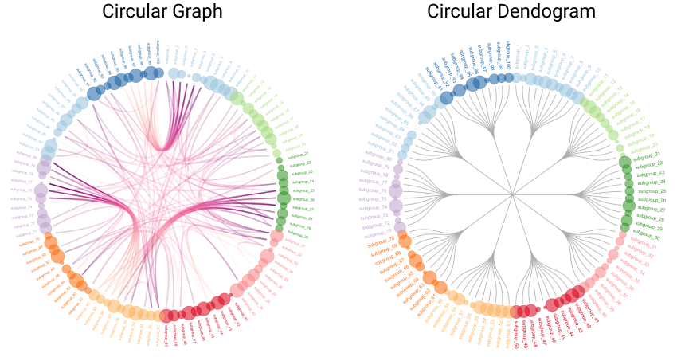

```{r, include = FALSE}
knitr::opts_chunk$set(
  collapse = TRUE,
  comment = "#>"
)
```

# Initial Idea

The initial idea was to use figures such as graphs or dendograms to represent some somatotopy data.
To help me in my research, Gérard gave me some links like this <a href="https://www.r-graph-gallery.com/index.html" target="_blank">one</a> showing what it was possibly possible to do with the R language depending on the chosen bookshops.



Keeping in mind that we had to stay in the world of the R language, the two packages that came out after some research were **ggraph** and **igraph**.

Moreover as it seemed possible for **networkD3** to convert a graph built with the **igraph** library or for **ggraph** to use the basic functions provided by **igraph**, I turned to the latter. Moreover I had at that time a much more consequent documentation on **igraph** than on the two others (Student subscription to the DataCamp site).

My first objective was therefore to construct a Graph representation of the data I had been provided with.

# Raw data frame segmentation

The data given to me was in the following form.

```{r setup}
options(width = 300)
library(somar)
```

```{r}
str(somar::experimental_data.df)
```

This dataframe above can be divided into 4 main parts.

**Metadata columns:** describing the conditions of the experiment as well as the mean of the related R-values

```{r}
somar::experimental_data.df[, 1:3]
```

**Correlation coefficients columns:** corresponding to the latter conditions

```{r}
somar::experimental_data.df[, 4:8]
```

**The p-value columns:** corresponding to the latter conditions

```{r}
somar::experimental_data.df[, 14:18]
```

**Other values columns:** that Gérard asked me not to take care of (CI columns)

The aim was therefore that each line could be represented by a graph.
The construction of basic graphs requires more precisely a sample as follows. 

```{r}
sample_number <- 1

somar::experimental_data.df[sample_number, 4:8]
somar::experimental_data.df[sample_number, 14:18]
```

It may be interesting later on that the data separation of a dataframe like the latter can be done automatically (respecting a column naming convention and a precise dataframe structure). This is so that the user can have a quick and general idea of each of his graphs in order to make a more precise selection afterwards.

# Graph Construction


# Automatic segmentation of the data frame
