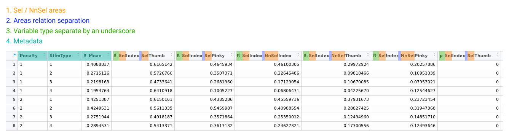

```{r, include = FALSE}
knitr::opts_chunk$set(
  collapse = TRUE,
  comment = "#>"
)
```

# Road Map

To get the most out of this first version, the dataframe to be processed should ideally respect a certain naming convention for these columns.

1. the names related to the somatotopy areas must be prefixed with Sel or NnSel to designate whether it is a selected zone or not. 

2. The two related areas in a column must then be separated by an underscore.

3. The variable related to the last two must then prefix the name of the column followed by an underscore.

4. The metadata must not contain more than one underscore.

**For a visual example, you can refer directly to the experimental dataset directly accessible in the pacakge somar::experimental_data.df**


  
If each of these conditions is well respected, it is then possible to use the automatic function of the package. Please note that this function has been created to give the user a visual overview (graph) of each of the lines of his dataframe so that he can then make a selection and redraw the graphs that he thinks are the most relevant using the other available functions.

**Warnings:** Beware the graph ethic depends strongly on the attributes that have been added to your dataframe. So it goes without saying that this part will certainly have to be customized according to your needs. This is why there is a detailed guide for more details. As well as a design thumbnail if you want to know the construction logic behind this package.

```{r fig.align="center", out.width = '100%'}
# grid_graph_automatic_construction(df)
# Unfortunately not very interesting to display in a thumbnail due to the space available.
```
